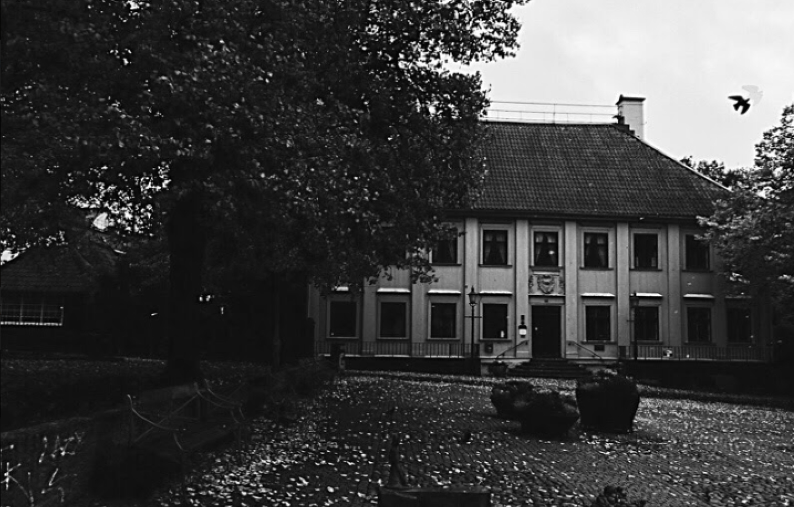

# Gathenhielmska Huset

## Description
School assignment at Yrgo: Create a website for Gathenhielmska Huset

## Built with
* Wordpress
* CSS/Sass
* JavaScript

## Requirements
* Mobile first
* Landningssida 
* Nyheter
* Kalender/Evenemang - lista över evenemang
* Bokningssystem för evenemang med formulär där man kan fylla i tid, plats, kontakt, typ av evenemang och kort text för beskrivning.
* Kontaktformulär
* Information om verksamheten
* Språkversioner i framtiden
* Bild-/filmarkiv. 
* Sökfunktion
* Header
* Footer 

## Installation
TBA

## License
This project is licensed under the [MIT License](https://github.com/camiwd/gathenhielmska-huset/blob/master/LICENSE) - see the LICENSE file for details.

## Authors

Digital designers:
* Elin Iller
* Rasmus Hermansson

Web developers:
* [Thomas Sönnerstam](https://github.com/ThomasSonnerstam)
* [Camilla Kylmänen Sjörén](https://github.com/camiwd)